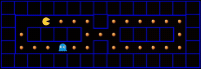

## Pacman Reinforcement Learning Pipeline

Reinforcement Learning Pipeline to train a Python based agent to learn how to play a PacMan style game built in a C++ environment.

## Project Status

This project is currently in testing. The communication between the Python model and the C++ environment via JSON IO-pipelines works. The basic training architecture (replay buffer and DQN) works and has been successfully tested on a minimal version of the game.
Currently working on upscaling the training to more complex versions of the game by refining feature engineering and hyperparameter tuning. 





## System Architecture

The project implements a hybrid C++/Python architecture to benefit from a high performance game-engine and powerful ML tools.

* **Game Environment (C++):** Built from scratch using **SFML** for rendering and physics. Handles the game loop,state management and custom reward function.
* **IPC Bridge:** OS-specific `EventLogger` implementations handling inter-process communitcation via **IO Pipes** (Windows Pipes / Unix Fork & Exec) to stream game state data.
* **ML Worker (Python):** Consumes JSON game snapshots via `stdin`, separating the AI logic from the game-engine.
* **Feature Engineering:** `feature_engineer.py` extracts custom features from the raw game states (e.g., relative enemy positions, wall distances).
* **RL Agent:** `rl_agent.py` implements a **Deep Q-Learning (DQN)** agent with Experience Replay and Target Network for stable training.

## Requirements

* **C++ Compiler:** C++17 compatible (GCC, Clang, MSVC)
* **Build System:** CMake (3.28+)
* **Python:** 3.x
* **Libraries:** SFML 3.0.1 (fetched automatically via CMake)
* **PyTorch, Pandas, NumPy (install via pip)

## Build & Installation

### 1. Clone the Repository
Start by cloning the repository to your local machine:

```bash
git clone [https://github.com/viktic/pacman-ai-pipeline.git](https://github.com/viktic/pacman-ai-pipeline.git)
cd pacman-ai-pipeline
```
### 2. Create and activate virtual environment
```bash
python -m venv venv
```

##### On Windows:
```bash
venv\Scripts\activate
```
##### On Unix/MacOS:
```bash
source venv/bin/activate
```

### 3. Install python dependencies
```bash
pip install -r requirements.txt
```

### 4. Configure paths
run the configuration script to generate absolute paths
```bash
python scripts/path_configurator.py
```
> **_NOTE:_**  If you manually change the contents of the paths.json file, you have to run a clean rebuild to ensure that it gets copied into the runtime directory correctly

### 5. Build the C++ Engine
use CMake to configure and build the project. SFML and other C++ dependencies will be fetched automatically
```bash
mkdir build && cd build
cmake ..
cmake --build .
```

### 6. Run the training
execute the generated binary

##### On windows
##### On Windows
```bash
cd bin\Debug
.\main.exe
```
##### On Unix/MacOS
```bash
cd bin
./main
```


